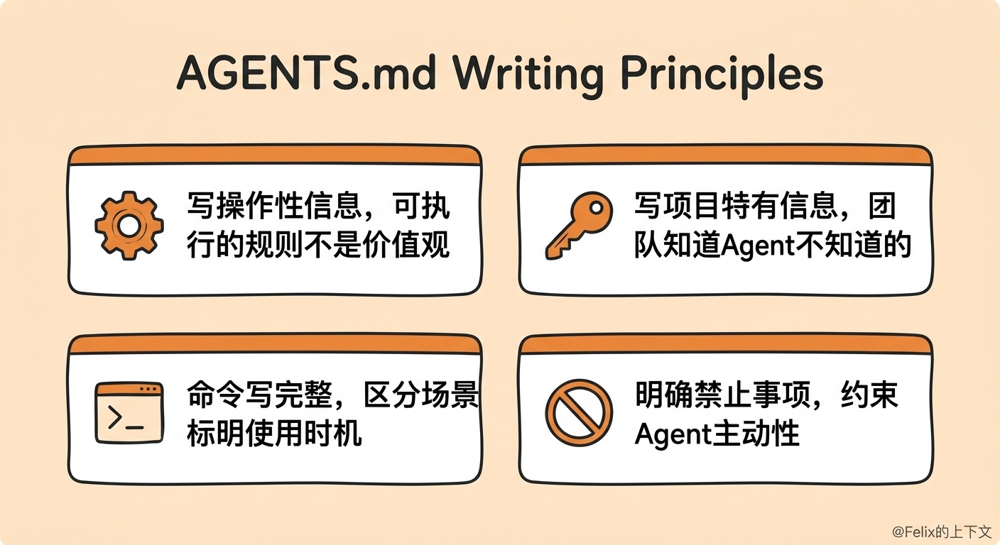

## 项目级 Instruction 与 AGENTS.md

项目级 Instruction 的本质是给 Coding Agent 一份项目操作手册：让 Agent 少猜、少搜、少试错，按照团队认可的方式理解项目、修改代码、运行验证。

### 推荐阅读：

1. https://claude.com/blog/using-claude-md-files

2. https://agents.md

### 指令文件类型

GitHub Copilot 支持两种自定义指令文件：

- .github/copilot-instructions.md — Copilot 原生格式

- AGENTS.md — 跨工具通用格式，推荐

### 写什么

可以先用 Copilot 的 init 命令生成初稿，但务必根据项目实际情况修改。一份好的 Instruction 通常包含：

| 内容类型 | 说明 |
| ---- | ---- |
| 项目描述 | 基本信息和定位，大致的技术栈 |
| 目录结构 | 目录树，深度根据项目规模决定 |
| 关键文件说明 | 核心文件的职责和相互关系 |
| 开发规范 | 测试、构建、编码风格，以及项目特有的经验和约定 |

### 写作原则

写操作性信息，不写空话。 Agent 需要可执行的规则，不是价值观。

| bad | good |
| ---- | ---- |
| Write clean code. | Keep business logic in src/server/services. |
| Follow best practices. | Run pnpm test -- --runInBand when touching database-related tests. |

写项目特有信息，不写通用常识。 最有价值的内容是"团队成员知道，但新来的 Agent 不知道"的信息。

命令写完整，标明使用场景。 不要只写 Run tests with pnpm test，要区分场景：小改动跑单文件测试，改了共享逻辑跑全量测试，改了路由/认证/构建跑 lint + build + test。

明确禁止事项。 Agent 最大的问题往往不是不会写代码，而是太主动。应该明确写出 Do not 清单：不要擅自加依赖、不要大范围重构、不要改 public API 却不更新测试和文档、不要跳过测试就声称已验证。