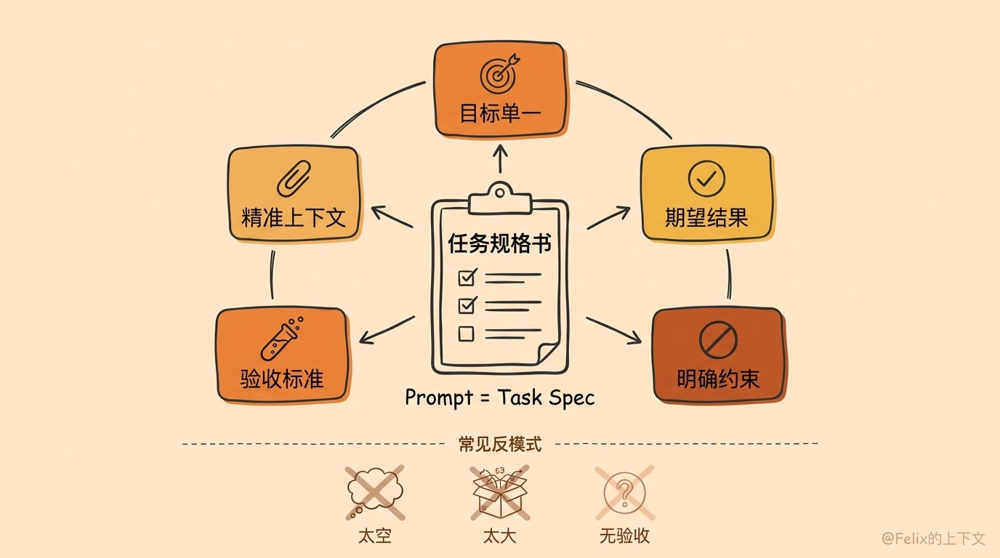
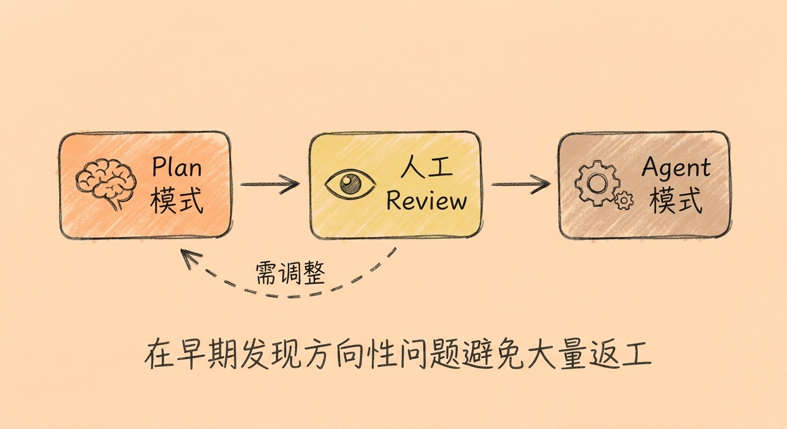
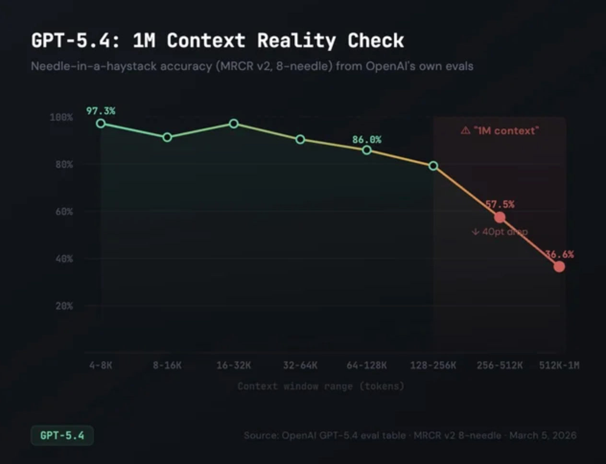

# 内容概览

1. 写好 Prompt — 把每次输入当作"任务规格书"，用 5 个关键要素写出高质量的任务描述

2. 先规划再动手 — 善用 Plan 模式，把"想"和"做"分开，避免方向性返工

3. 控制会话范围 — 保持上下文精简，单次会话专注一个小任务

4. Best Practices — 小幅修改、交叉验证、精简工具，确保 AI 输出质量

5. 功能介绍 — Git Commit Message 规范、AGENTS.md 编写与维护、自定义 Code Review Agent

6. 推荐工具与资源 — Agent / Skill / MCP 概念辨析，实用工具推荐，自定义 Skills

7. 署名是你的，责任也是 — AI 写的代码以你的名字提交，质量由你把关.

## 1. 写好 Prompt — 把每次输入当作"任务规格书"

在 Coding Agent 场景下，长期规则（项目结构、编码规范、构建命令等）已经写在 AGENTS.md 或 copilot-instructions.md里了，不需要每次重复。你每一次输入的 Prompt，本质上是这次任务的执行说明：改什么、为什么改、允许动哪里、怎么验证、什么叫完成。

### 1.1 好 Prompt 的 5 个关键要素

1. 目标单一、边界清楚 — 不要把多个任务混在一起。"重构支付模块"太大，"修复 Stripe webhook 重复入账问题，改动范围限定在 billing/webhook.ts 和相关测试"才是一个好的任务单元。

2. 描述期望结果，而非只描述动作 — 不要只说"帮我实现一下"，要把最终行为说清楚：接口返回什么、用户看到什么、错误场景怎么处理。

3. 写清"不要做什么" — 约束越明确，AI 的自由发挥空间越小，漂移越少。比如：不要改 public API、不要升级依赖、不要碰无关文件、只补测试不改业务逻辑。

4. 给出验收标准 — 这是最容易被忽略、但最有价值的一条。告诉 AI 怎么证明"改对了"：运行哪些测试、跑什么命令、预期什么行为。没有验收标准，AI 很容易交出"看起来改了，但没证明改对了"的结果。

5. 只给强相关的上下文 — 提供相关文件名、错误日志、接口契约、复现步骤。不要把整个项目背景长篇大论复制进去，把 Prompt 当作写给一个"聪明但刚入职的新同事"的任务单。

### 1.2 反面示例 vs 正面示例

| bad prompt | good prompt |
| ---- | ---- |
|  修复登录 bug    |  用户在 token 过期后刷新页面会卡在 loading。范围限定在 src/auth/* 和相关测试，不要修改 API 返回结构。预期行为：token 失效时自动跳转登录页。请先定位根因再实现最小修改，补充覆盖该场景的测试，运行测试和 lint。    |
|   写测试   |   add_book() 函数生成 pytest 测试。覆盖：正常输入、重复添加、空标题、标题超 200 字符、作者名含特殊字符。   |
|    重构这段代码  |    将第 30-55 行的 if-elif 链重构为字典分发模式，保持函数签名和返回值不变。  |

### 1.3 三类常见的差 Prompt

- 太空："优化一下这里"、"看着改一下" — 任务合同不存在，AI 只能猜

- 太大：把跨模块重构、架构升级、文档补齐一次性交给 Agent — 范围越大，失控概率越高

- 只有目标没有验收："修复这个 bug" — AI 交出"看起来改了"但没有验证手段

## 2. 先规划再动手 -- 善用 Plan 模式

Copilot 提供两种工作模式：

- Plan 模式：只读不写。AI 会充分搜索和阅读代码库，收集足够的上下文信息，生成一份结构化的分步实施方案。因为不急于动手修改，它能更全面地理解现有代码结构和依赖关系，做出更合理的决策。

- Agent 模式：读写兼备。AI 会自主规划并执行——直接修改代码、运行命令、调用工具，边想边做。它也有规划能力，但不会单独输出方案供你审查，而是规划与执行同步进行。

两者的核心区别：Plan 模式把"想"和"做"分开，Agent 模式把"想"和"做"合在一起。

建议的工作流程是：先用 Plan 模式让 AI 充分了解项目现状并生成方案，Review 方案确认合理后，再切换到 Agent 模式执行修改。这样可以在早期发现方向性问题，避免大量返工。

## 3. 控制会话范围，保持上下文精简

每个 Agent 会话应专注于一个明确的小任务。如果任务较大，建议先与 AI 讨论拆分方案，将其分解为若干子任务并记录为文档，然后为每个子任务开启独立会话。

模型的输出质量会随上下文长度的增加而下降，建议将单次会话的上下文控制在 200K 以内。

Copilot 界面会显示当前用量，可作为参考。

## 4. Best Practices

### 4.1 每次只做小幅修改

避免让 AI 一次性修改大量代码。修改范围过大会导致人工 Review 困难，长此以往容易放弃 Review。而现阶段 AI 生成的代码质量尚不能完全满足我们的代码要求，人工审查仍然不可或缺。

### 4.2 使用不同模型交叉验证

不同厂商的模型在训练数据和方法上存在差异，各有擅长的领域。对于关键决策或复杂方案，建议使用不同 Provider 的模型进行交叉验证，以完善和验证方案的合理性。

### 4.3 精简 Copilot 启用的 Tools

VS Code 中许多插件默认会注册 MCP 等 Tools，并在 Copilot 中自动启用。这些 Tools 会占用额外的上下文空间，建议只保留实际需要的，禁用其余的。
